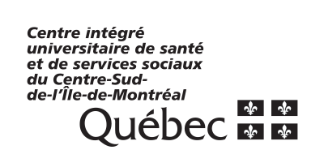
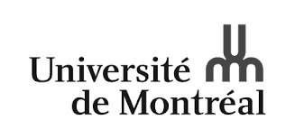

Courtois NeuroMod
=================

.. note:: The core acquisitions of the CNeuroMod project have been completed in 2023. Datasets are still being improved and new assets released continuously. This documentation describes the datasets as they are currently available.

The Courtois project on Neural Modelling (CNeuroMod) aims at training artificial neural networks using extensive experimental data on individual human brain activity and behaviour, including active videogame tasks. Six subjects were scanned weekly for five years (2018-23), with more sporadic scanning sessions still ongoing.

The cneuromod dataset currently features up to 200 hours of functional data per subject, including functional localizers (vision, language, memory, emotion), movies and video game play. So far functional neuroimaging data have been collected with functional magnetic resonance imaging and a variety of sensors (including electrodermal activity and occulometry). A smaller subset of data was collected with electroencephalography. A new wave of MEG data will be collected in summer 2026.

The cneuromod project is funded by a donation of the Courtois foundation. Courtois NeuroMod data are freely shared with the scientific community to advance research at the interface of neuroscience and artificial intelligence. Five out of six subjects have shared their data without any restriction, while access to the full sample follows a registered access model.

An overview of the project is available on the Courtois `website <https://www.cneuromod.ca/>`_ and the technical documentation of the latest release is accessible `here <https://docs.cneuromod.ca/>`_.

